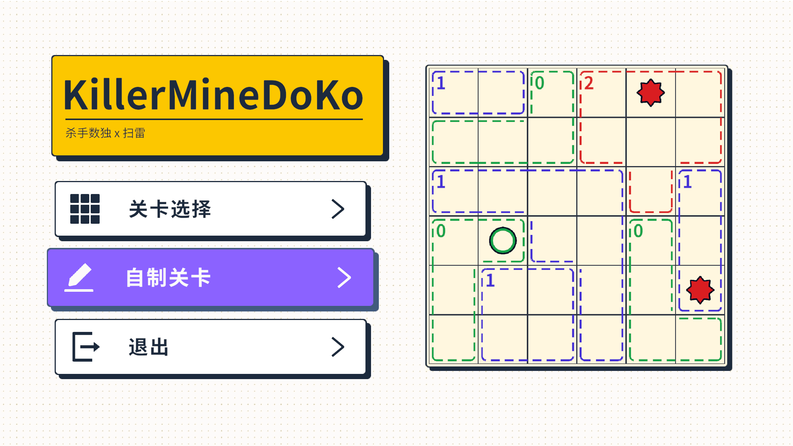

# KillerMineDoku

网页试玩地址：https://mffyyy.github.io/KillerMineDoku/

这是一个结合杀手数独和扫雷的解谜小游戏。每个虚线框里的数字表示这个区域里有几颗雷，你要根据行列提示和区域提示，把安全格、雷和旗子一步步推出来。

玩法很简单：

- 左键标记安全格。
- 右键标记雷或旗子。
- 每一行、每一列、每个虚线区域的雷数都要对上。
- 通关预设关卡后，可以导入自己做的 JSON 关卡继续玩。

